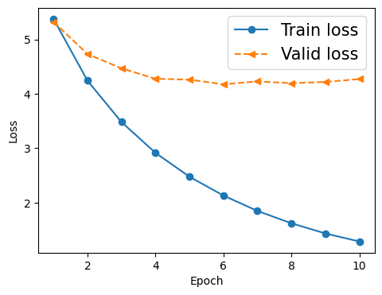

# Machine translation seq2seq LSTM to correct grammatical errors (GEC)

The goal of the project is a seq2seq approach where the input is a source 
sentence with grammatical errors and the output a target sentence as a 
corrected version of the input. For each sentence, the model receives input 
token xi and should predict output token yi, where 
yi is a correction, if xi needs amelioration (e.g. 
correct spelling, additional prepositions, etc.). In other words for the 
input vectors of xi to the encoder, the decoder should produce 
output vectors yi. For this reason, the task can also be 
characterized as a "many-to-many" version of sequence modeling 
[(Kaparthy 2015)](https://karpathy.github.io/2015/05/21/rnn-effectiveness/).

This repository contains the necessary preprocessing scripts as well as an 
extensive Jupyter notebook for implementing a seq2seq model on Google Colab. 
Finally, it provides an updated script to calculate the [General Language Evaluation 
Understanding (GLEU)](https://aclanthology.org/P15-2097.pdf) score for model 
tests. The GLEU script is taken and adapted from: 
https://github.com/cnap/gec-ranking/tree/master?tab=readme-ov-file

## Version

Scripts were developed with Python **3.11**. The following packages need to be 
installed: `matplotlib`, `numpy`, `scipy.stats`, `torch`, `torch.nn`, 
`torch.optim`, `torchtext.vocab`, `tqdm`

## Data

Cambridge English Write & Improve (W&I) corpus created for the [Building Educational Applications 2019 
Shared Task: Grammatical Error Correction](https://www.cl.cam.ac.uk/research/nl/bea2019st/). 
Consider the following publication: 

Helen Yannakoudakis, Øistein E. Andersen, Ardeshir Geranpayeh, Ted Briscoe 
and Diane Nicholls. 2018. Developing an automated writing placement system 
for ESL learners. *Applied Measurement in Education*, 31:3, pages 251-267.

## Model

The model used for the task is a PyTorch implementation of an LSTM by
[Ben Trevett](https://github.com/bentrevett/pytorch-seq2seq/).

## Evaluation

The inference results from the model are saved to `test/[model_name]/` 
where `references.txt` correspond to the correct solutions, `sources.txt` 
contains the sentences from writers, and `targets.txt` contains the 
solutions provided by the model.

To calculate GLEU for the given results, please run:

>$ python3 compute_gleu3.py -r test/model_name/references.txt -s 
> test/model_name/sources.txt -o test/model_name/targets.txt

This repository contains the results of the best model as of 05.07.2024 
stored at `test/`.

## Results

Overall, the LSTM performs inadequately on the task with the provided data. 
Adjustments to hyperparameters, including hidden units, dropout, 
teacher-forcing ratio, embedding dimensions for the vocabulary, and batch 
size, resulted in minor improvements in the outputs. Data augmentation was 
also attempted by doubling the training set using target sentences as 
additional pairs of correct sources. Again, this led to some improvements.

**Training**
After training, the model exhibits high variance, as evidenced by the 
discrepancy in loss between the training and validation sets.

**GLEU** The GLEU score for the model predictions of the test items 
provided in this repository is `0.036604`.

**Example** For a given, incorrect source sentence the model makes the 
following prediction (where the target represents the correction):

> **Source**: There have been a number of cases in the last ten years of the 
> top few boxers having tragic losses throughout their ranks .

> **Target**: There have been a number of cases in the last ten years of the 
> top few boxers having tragic losses **among** their ranks .

> **Prediction**: there have been a number of changes in the last ten years in 
> the of of and and a a famous man .

**Improvements** To reduce high variance a few measures can be applied:
(a) more training data, (b) better regularization, (c) reducing complexity 
of the model.

**Interpretation** The model fairs poorly on the task as many of the 
grammatical errors are very sparse and may only appear in the validation 
and test sets.

I want to thank [Meng Li](https://limengnlp.github.io/) for the idea of this project.

